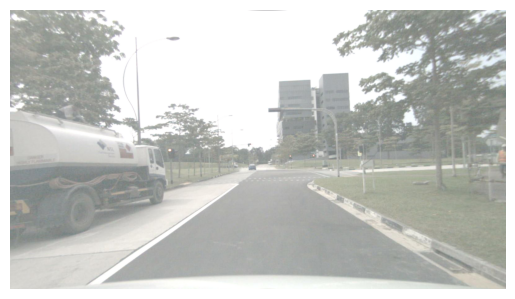
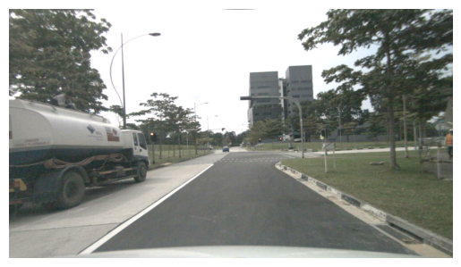
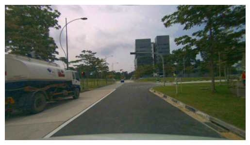
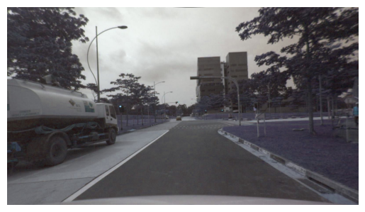

#### 代码阅读

##### 知识点

- ：

##### 可视化

* 光度失真数据增强可视化 ( #CN/00002# )
  * 调整亮度，图像整体变亮/暗；调整对比度，图像整体变亮/暗但色彩自然些（不会像调整亮度那样整体发白），越亮/暗的地方调整后越亮/暗
  * 调整饱和度，图像颜色越浓/淡；调整色度，图像色调沿色轮（红橙黄绿青蓝紫）顺/逆时针旋转，如图加 180 度顺时针旋转，绿色变成紫色
  * |  |  |  |
    | :-------------------------------------------------: | :-------------------------------------------------: | :-------------------------------------------------: |
    |                        原图                        |                      亮度+100                      |                     对比度*1.5                     |
    |  |  |                                                    |
    |                      饱和度*3                      |                     色度+180度                     |                                                    |
